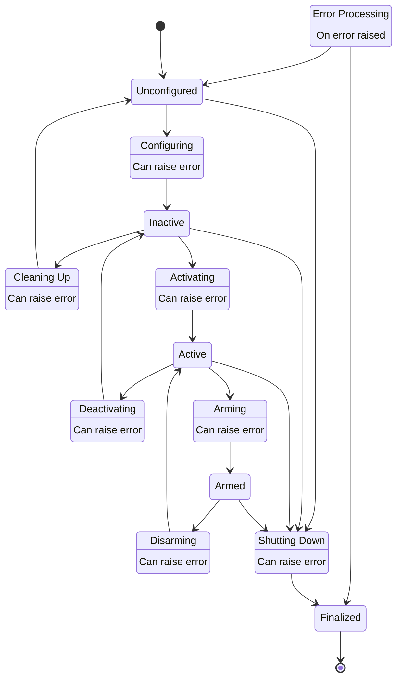

# rSTATE

**rSTATE** is a ROS2 node designed to coordinate actions of a ROS2 network. Internally it is a state machine that allows for user definitions of network states and transitions. The state machine is largely designed to replicate the behaviour of [ROS2 managed lifecycle](https://design.ros2.org/articles/node_lifecycle.html) nodes on the network scale (with some extensions).

It offers 5 primary states:

- `Unconfigured`
- `Inactive`
- `Active`
- `Armed`
- `Finalized`

Transitions from primary states required external action, **rSTATE** cannot perform these transitions uncommanded.

There are 8 transition states:

- `Configuring`
- `Cleaning Up`
- `Activating`
- `Deactivating`
- `Arming`
- `Disarming`
- `Error Processing`

The transitions to and from these states are performed automatically when **rSTATE** is commanded with a valid transition.

There are 7 transitions available as commands for external processes:

- `Configure`
- `Clean Up`
- `Activate`
- `Deactivate`
- `Arm`
- `Disarm`
- `Shutdown`

These transitions are provided as goals in a [ROS2 action server](http://design.ros2.org/articles/actions.html).

## Primary State: Unconfigured

All managed lifecycle nodes controlled by **rSTATE** are `unconfigured`. No processes on the network are running.

## Primary State: Inactive

All managed lifecycle nodes controlled by **rSTATE** are `inactive`. No processes on the network are running.

## Primary State: Active

All managed lifecycle nodes controlled by **rSTATE** are `active`. The network is now allowed to execute intrinsically safe processes such as data logging. Nodes on the network must not advertise potentially unsafe actions such as valve actuation during this network state.

## Primary State: Armed

All managed lifecycle nodes controlled by **rSTATE** are `active`. The network is now allowed to execute all actions.

## Primary State: Finalized

All managed lifecycle nodes controlled by **rSTATE** are `finalized`. **rSTATE** will also finalize. From this state, the network must be restarted.

## Transition State: Configuring

**rSTATE** will `configure` all managed lifecycle nodes that it controls. If `cancel_goal` is recieved durring this transition, all nodes will be returned to `unconfigured`.

## Transition State: Cleaning Up

**rSTATE** will `cleanup` all managed lifecycle nodes that it controls. If `cancel_goal` is received during this transition, all nodes will be returned to `inactive`.

## Transition State: Activating

**rSTATE** will `activate` all managed lifecycle nodes that it controls. If `cancel_goal` is received during this transition, all nodes will be returned to `inactive`.

## Transition State: Deactivating

**rSTATE** will `deactivate` all managed lifecycle nodes that it controls. If `cancel_goal` is received during this transition, all nodes will be returned to `active`.

## Transition State: Arming

**rSTATE** will `arm` all nodes that it controls that have potentially unsafe actions. If `cancel_goal` is received during this transition, all nodes will be `disarmed`.

## Transition State: Disarming

**rSTATE** will `disarm` all nodes that it controls that have potentially unsafe actions. If `cancel_goal` is received during this transition, all nodes will be `armed`.

## Transition State: Shutting Down

**rSTATE** will `shutdown` all managed lifecycle nodes that it controls. Due to the nature of lifecycle nodes, this action cannot be cancelled.

## Transition State: Error Processing

**rSTATE** will attempt to return the network to the `unconfigured` state. If this is not possible the network will be `shutdown`.
